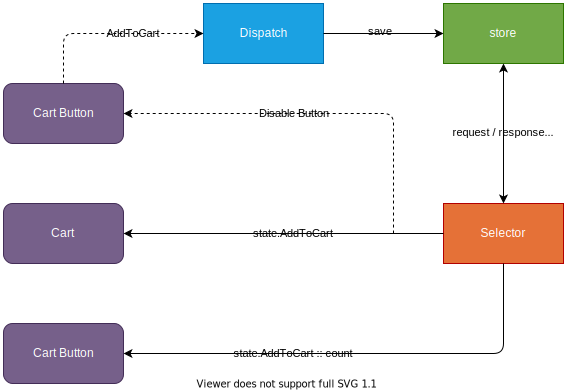

# Redux - Introducción a redux-toolkit

Para nuestra aplicación vamos a implementar Redux de la siguiente manera: Tenemos un componente `Cart Button`, el se encarga de enviar la alerta al `dispatch` para que dispare la función `AttToCart`, la cual enviará la información a guardar o actualizar dentro del `store`. Dicho `store` puede hacer peticiones al `selector` para o recibir peticiones del mismo, básicamente será un escucha de las acciones del `store`, a su vez contará la cantidad de items dentro del `store` y lo enviará al `Item Card`, desactivará el botón `Cart Button` e informara la descripción de los elementos que tenemos en el `store` dentro de un component `Cart`.



A lo largo de esta lección vamos a crear un método para agregar al carrito, otro para remover del carrito, otro para contar la cantidad de items agregados al carrito (sin tocar, ni resetear la lista del estado), y deshabilitaremos el botón de agregar al carrito cuando se agregue el elemento.

Inicialmente vamos a crear el store, diagramaremos y armaremos el slice del cart, crearemos custom hooks en TS e inicializaremos el store con un Provider. Con respecto a lo que llevamos al proyecto, hacemos las siguientes modificaciones:

1. Añadimos un botón a las tarjetas el cual usaremos luego para añadir los elementos al carrito.

   ```tsx
   export const CardComponent: FC<Character> = ( { id, image, name, status, species } ) => {
        const navigate = useNavigate()

        return (
            <Card sx={ { maxWidth: "345px" } }>
                ...
                <CardActions>
                    ...
                    <Button variant="outlined" color="secondary" fullWidth disabled>Add to cart</Button>
                </CardActions>
            </Card>
        )
    }
   ```

2. Codificamos un componente llamado `<HorizontalCardComponent />` en el cual vamos a renderizar a través de tarjetas una pequeña información de los items que están en el carrito:

   ```tsx
   import { Card, CardActions, CardContent, CardMedia, Divider, Grid, IconButton, Typography } from "@mui/material"
   import { FC } from "react"
   import { Character } from "../../types"
   import { CloseRounded as CloseRoundedIcon } from '@mui/icons-material'

   export const HorizontalCardComponent: FC<Character> = ( { id, name, image, status } ) => {
        return (
            <Card sx={ { display: "flex", my: 2 } }>
                <CardMedia component="img" sx={ { width: 151 } } image={ image } alt={ name } />

                <Grid container sx={ { mx: 1 } }>
                    <Grid item xs={ 10 }>
                        <CardContent>
                            <Typography variant="h4">{ name }</Typography>
                            <Divider />
                            <Typography variant="h6">{ status }</Typography>
                        </CardContent>
                    </Grid>

                    <Grid item xs={ 2 }>
                        <CardActions>
                            <IconButton >
                                <CloseRoundedIcon />
                            </IconButton>
                        </CardActions>
                    </Grid>
                </Grid>
            </Card>
        )
   }
   ```

3. Creamos un componente llamado `<CartComponent />` en el cual vamos a listar los elementos que se encuentran en el carrito. Este componente ha de recibir un estado para saber si se ha de cerrar o abrir, además de que comparte una función para manejar dicho estado. Por el momento tendremos una lista de items vacía, pero más adelante la reemplazaremos por la lista dinámica que se reciba del store.

   ```tsx
   import { CloseRounded as CloseRoundedIcon } from "@mui/icons-material"
   import { Box, Divider, Drawer, IconButton, Stack, Typography } from "@mui/material"
   import { FC } from "react"
   import { HorizontalCardComponent } from "../components"
   import { ThemePalette } from "../helpers/util"
   import { Character } from "../types"

   type CartComponentProps = {
        open: boolean
        handleStateViewDrawer: () => void
   }

   export const CartComponent: FC<CartComponentProps> = ( { open, handleStateViewDrawer } ) => {
        const items: Character[] = []
        return (
            <Drawer anchor="right" open={ open } className='navbar__glassmorphism'
                sx={ {
                    background: "rgba(0, 0, 0, 0.5)",
                    boxShadow: `0 1px 5px 0 ${ ThemePalette.LIGHT_LIME }`
                } }>
                <Box sx={ { width: '25em', p: 2 } }>
                    <Stack direction="row"
                        justifyContent="space-around"
                        alignItems="center"
                        position="relative"
                        sx={ { mb: 1 } }>
                        <Typography variant="h5">Cart</Typography>
                        <IconButton onClick={ handleStateViewDrawer } sx={ { position: "absolute", right: 0 } }>
                            <CloseRoundedIcon />
                        </IconButton>
                    </Stack>
                    <Divider />
                    {
                        ( !items || !items.length )
                            ? <Typography sx={ { m: 2 } }>'No hay elementos en el carrito'</Typography>
                            : items.map( character => <HorizontalCardComponent key={ character.id } { ...character } /> )
                    }
                </Box>
            </Drawer>
        )
   }
   ```

4. Lo que resta es usar el componente anterior dentro del `<NavBar />` de manera que al presionar el icono del carrito se abra el componente con el listado:

   ```tsx
   ...
   import { CartComponent } from './Cart'

   const NavBar: FC = () => {
        ...
        const [ open, setOpen ] = useState<boolean>( false )

        const handleStateViewDrawer = () => {
            setOpen( !open )
        }

        return (
            <Box ...>
                <AppBar ...>
                    <Toolbar>
                        <Container ...>
                            <Grid ...>
                                ...
                                <Grid item>
                                    <Stack ...>
                                        <IconButton color="primary" onClick={ handleStateViewDrawer }>
                                            <Badge color="error" badgeContent={ 2 }>
                                                <ShoppingCartOutlinedIcon />
                                            </Badge>
                                        </IconButton>
                                        ...
                                    </Stack>
                                </Grid>
                            </Grid>
                        </Container>
                    </Toolbar>
                </AppBar>
                
                <CartComponent open={ open } handleStateViewDrawer={ handleStateViewDrawer } />
            </Box >
        )
    }

   export default NavBar
   ```

Iniciaremos con Redux por lo que instalaremos react-redux y redux-toolkit con el siguiente comando:

```txt
pnpm i @reduxjs/toolkit react-redux
```

Lo siguiente será crear un directorio para almacenar todo lo relacionado a redux (store, custom hooks, slices). La configuración inicial del store consiste en determinar el reducer del store, y luego exportamos tanto el store, como el tipo del estado que está en el store, y el tipo del dispatch:

```tsx
import { configureStore } from "@reduxjs/toolkit"

export const store = configureStore( {
    reducer: {}
} )

export type RootState = ReturnType<typeof store.getState>
export type AppDispatch = typeof store.dispatch
```

Lo siguiente es proveer el store a toda la aplicación, por lo que dentro del archivo `index.tsx` o `main.tsx` usamos un provider:

```tsx
import { Provider } from 'react-redux'
import { store } from './redux/store'

ReactDOM.createRoot( document.getElementById( 'root' ) as HTMLElement ).render(
    <React.StrictMode>
        <Provider store={ store }>
            <ThemeConfig>
                <App />
            </ThemeConfig>
        </Provider>
    </React.StrictMode>,
)
```

Creamos los hooks iniciales relacionados a redux, con los cuales tratamos de mantener el tipado del store en toda la aplicación:

```tsx
import { useDispatch, useSelector } from 'react-redux'
import type { TypedUseSelectorHook } from 'react-redux'
import type { AppDispatch, RootState } from './store'

export const useAppDispatch: () => AppDispatch = useDispatch
export const useAppSelector: TypedUseSelectorHook<RootState> = useSelector
```

Para el slice del carrito tendremos la siguiente configuración de manera provisional:

```tsx
import { createSlice } from "@reduxjs/toolkit"

interface CartState { }

const initialState: CartState = {}

export const cartSlice = createSlice( {
    name: 'cart',
    initialState,
    reducers: {}
} )

export const { } = cartSlice.actions
```

Luego añadimos el reducer dentro del store:

```tsx
import { cartSlice } from "./slices"

export const store = configureStore( {
    reducer: {
        cartReducer: cartSlice.reducer
    }
} )
```

Entrando un poco más en materia con el slice del carrito, definimos la interfaz con las propiedades que necesitamos, definimos cómo estado inicial un arreglo vacío con el tipo de acabamos de definir, y declaramos los 2 métodos que usaremos más adelante para el reducer:

```tsx
interface CartState {
    id: string | number
    name: string
    image: string
    origen: string
}

const initialState: CartState[] = []

export const cartSlice = createSlice( {
    name: 'cart',
    initialState,
    reducers: {
        addToCart: ( state, action: PayloadAction<CartState> ) => { },
        removeToCart: ( state, action: PayloadAction<CartState> ) => { }
    }
} )
```

Si ingresamos al navegador y usamos la extensión Redux DevTools, podremos observar que tenemos nuestro reducer perfectamente creado.

___

| Anterior                                                      |                        | Siguiente                                                                                              |
| ------------------------------------------------------------- | ---------------------- | ------------------------------------------------------------------------------------------------------ |
| [Navegación (useNavigate)](./P11T1_Navegacion_useNavigate.md) | [Readme](../README.md) | [Redux - Lógica de agregar y remover del carrito](./P13T1_Redux_Logica_agregar_remover_del_carrito.md) |
